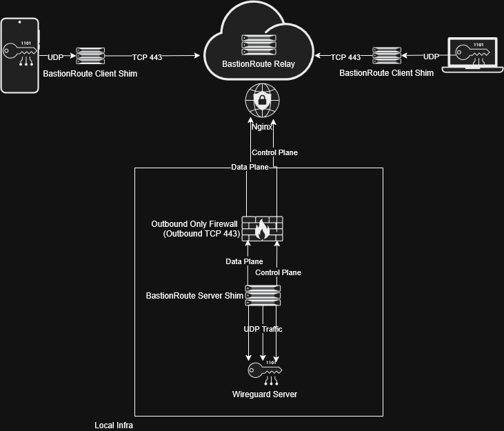

# BastionRoute (v0.1.0-alpha)

> **An outbound-initiated WebSocket relay fabric for binary streams that operates with zero-inbound port architecture.**

BastionRoute is an outbound-only binary stream relay fabric designed to route binary traffic over a stateful Layer-7 WebSocket transport.

By initiating all data pipelines via outbound-only connections, BastionRoute requires no open port exposure and does not interpret payload semantics. It only provides deterministic routing of binary streams between identified peers over an outbound WebSocket relay fabric. BastionRoute is a transport-agnostic relay fabric for routing binary streams between outbound-connected peers.

---

## ⚡ Architectural Core

BastionRoute leverages a decoupled, multi-shim architecture that separates the data plane from the control plane to optimize transport efficiency and preserve payload as-is.

* **Zero-Inbound Footprint:** The home gateway or target server establishes a persistent, outbound-initiated WebSocket control link to a stateless Cloud Relay. It does not require inbound ports under normal deployment configurations.
* **Double-Wrapper Encapsulation:** The binary payload is transparently ingested by a user-space Go shim, packed into Layer-7 WebSockets (the use of TLS via nginx or other reverse proxies is highly recommended). The payload is never altered. BastionRoute does only one thing, provides an outbound route over websockets.
* **Stateless Cloud Brokerage:** The public cloud relay functions as a relay broker with no knowledge of payload. It routes traffic based entirely on http path routing in memory. The payload contents injested in the architecture, remain unaltered throughout its lifecycle.
---

## 📦 Deployment Mechanics

### Prerequisites
* **Go 1.21+ compiler toolchain**
* `make` utility installed (standard on Linux/macOS)

### Installation & Compilation (Ubuntu)

BastionRoute utilizes a standard multi-binary `cmd/` architecture. The compilation step automatically leverages the `Makefile` to pull down required dependencies (including `github.com/gorilla/websocket`) and verify the Go environment. 

To download dependencies and compile all binaries into a localized execution folder simultaneously, run:

```
git clone https://github.com/klauscam/BastionRoute.git
cd BastionRoute
make
```

Once completed, both production-ready binaries will be available inside the local target execution directory:
* `bin/bastionroute-shim`
* `bin/bastionroute-relay`

To clean up build artifacts and purge compiled binaries from your workspace at any time, run:

```
make clean
```

---

## 🚀 Execution Guide

### 1. Running the Central Stateless Relay
Deploy the relay binary on a public-facing cloud server or localized DMZ boundary. This acts as the zero-knowledge broker mapping atomic routing tags in memory:

```
./bin/bastionroute-relay --port=8080
```

### 2. Running the Server-Side Shim (Server interface)
Execute the shim in server mode behind your restricted infrastructure to initiate the outbound-only WebSocket connection back to the public relay broker:

```
./bin/bastionroute-shim --wg-role=server --uri="wss://relay.yourdomain.com" --room="secure-room-id" --wg-ip="127.0.0.1" --wg-port=51820
```

### 3. Running the Client-Side Shim (Peer interface)
Execute the shim in client mode on your remote device. The internal user-space supervisor loop will automatically spin up a local interface to securely bridge your native WireGuard application:

```
./bin/bastionroute-shim --wg-role=client --uri="wss://relay.yourdomain.com" --room="secure-room-id" --peer-id="remote-peer-01" --wg-ip="127.0.0.1" --wg-port=51820
```

### OpenWrt
```bash
git clone https://github.com/klauscam/bastionroute.git
cd bastionroute
CGO_ENABLED=0 GOOS=linux GOARCH=amd64 go build -o bastionroute-shim
```

### Termux (Android)
```bash
git clone https://github.com/klauscam/bastionroute.git
cd bastionroute
GO_ENABLED=0 GOOS=android GOARCH=arm64 go build -o bastionroute-shim
```


### Running the Server-Side Control Plane
Run the shim in server mode behind your private infrastructure to establish the outbound control link to the public relay broker:

```
./bastionroute-shim --wg-role=server --uri="wss://relay.yourdomain.com" --room="secure-room-id" --wg-ip="127.0.0.1" --wg-port=51820
```

### Running the Client-Side User Pipeline
Run the shim in client mode on your remote device. The user-space supervisor loop will spawn a local UDP interface to bridge your native application:

```
./bastionroute-shim --wg-role=client --uri="wss://relay.yourdomain.com" --room="secure-room-id" --peer-id="remote-peer-01" --wg-ip="127.0.0.1" --wg-port=51820
```

---


---

## (Example 1) WireGuard Network over BastionRoute

---

### Architectural Diagram



---

### 🚀 Performance Notes

#### Performance characteristics depend heavily on:
* underlying network conditions
* WebSocket implementation (e.g. TLS termination)
* MTU configuration
* relay latency and placement

### Observed Test Conditions (Example Setup)

#### The following results were observed under controlled testing conditions:

* High-latency mobile network (~165 ms RTT)
* Standard Linux kernel networking stack
* Single relay instance

#### UDP Throughput (through tunnel)
* Peak throughput: ~80 Mbps
* Jitter: ~0.145 ms

#### TCP Throughput (through tunnel)
* Sustained throughput: ~45–65 Mbps
* Stable under moderate packet loss conditions

>* Note: Results are workload- and environment-dependent and are not guaranteed. iperf3 used for benchmarking unless otherwise stated

---

### 🛠️ Engine Configuration & Tuning Matrix

To achieve optimal performance across lossy or highly latent WAN links, the following operating system and network settings are natively utilized:

#### 1. Loopback MTU Stabilization Matrix
To prevent catastrophic packet fragmentation at physical gateway boundaries, the underlying virtual WireGuard interface must be clamped to account for encapsulation overhead:

$$\text{MTU} = 1280 \text{ bytes}$$ (recommended baseline)

#### 2. Linux TCP Optimization (Relay Node)
BBR congestion control may improve performance under high RTT conditions:

```bash
# Enable BBR Congestion Control on the host system
sudo sysctl -w net.core.default_qdisc=fq
sudo sysctl -w net.ipv4.tcp_congestion_control=bbr
```

### Security Model (for WireGuard example)

#### BastionRoute inherits security properties from WireGuard. Specifically:

* Payload encryption is handled entirely by WireGuard
* BastionRoute does not decrypt or inspect payload data
* Relay nodes do not require access to cryptographic keys

### Threat Considerations

This system does not provide anonymity guarantees. Traffic metadata such as timing, volume, and connection relationships may still be observable at the transport layer.

---

## Security Notice

BastionRoute provides transport relaying only.
Authentication, authorization, encryption, and access control remain the responsibility of the underlying data initiator configuration and deployment.

## Experimental Status

This software is currently alpha-quality software and should be evaluated thoroughly before production deployment.

## ⚠️ Legal & Usage Notice

BastionRoute is provided for legitimate network administration, research, and authorized deployment scenarios only.

Users are solely responsible for ensuring compliance with applicable laws, regulations, and organizational policies when deploying or using this software.

This software does not include mechanisms for enforcing usage restrictions and should not be deployed in environments where its use would violate applicable rules or agreements.

## License

This project is licensed under the Apache License 2.0.

The Apache License governs use, modification, and distribution of this software and includes its own limitation of liability and warranty disclaimers.

See the LICENSE file for full terms.
